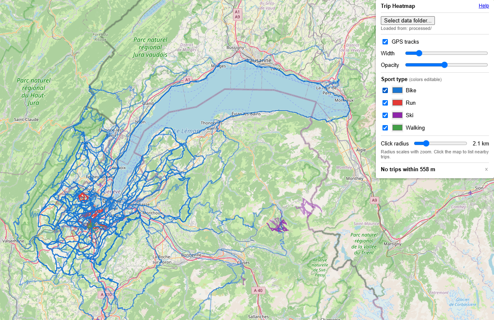
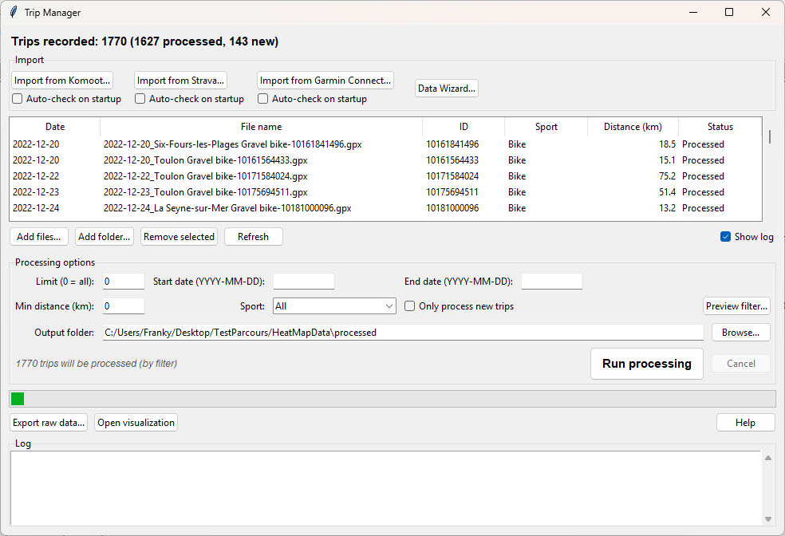
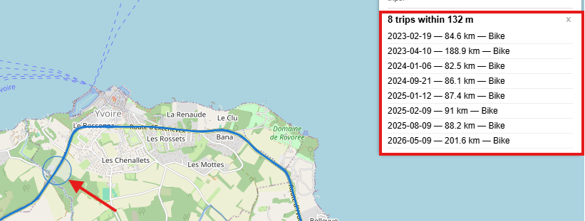

# Trip Manager

A personal GPS activity heatmap and dashboard for cyclists, runners, hikers, and skiers.
Import trips from Komoot, Strava, or Garmin, visualize them all on a single map, and explore
each trip's elevation, speed, heart rate, and cadence in an interactive dashboard.



## Features
- **Import** — download activities directly from Komoot, Strava, and Garmin, or add any GPX file

- **Heatmap** — all your trips overlaid on an interactive map (Leaflet + OpenStreetMap)

- **Trips** — See all your trips passing through a certain location

- **Dashboard** — per-trip charts for elevation, speed, heart rate, cadence, and power with a flexible layout (stack or combine any series, dual Y-axes)
- **Segments** — define named stretches of road/trail and see a leaderboard of all trips through them, ranked fastest to slowest; compare two efforts side by side on the segment
- **Compare mode** — overlay two trips (or two segment efforts) side by side to compare pace, elevation, power, and more
- **X-axis toggle** — switch between distance and time on all charts at once
- **Color modes** — line, gradient fill, or value-based coloring (green → red by speed)
- **Data Wizard** — inspect and clean your trip library: filter by sport/date/source/sensor, detect color-coded duplicate pairs, delete raw or processed files
- **Self-contained viewer** — `combined.html` works in any browser with no server required for offline use, or via the built-in local server for compressed data

## Requirements

- Windows 10/11
- Python 3.9+ ([python.org](https://www.python.org/downloads/))

## Getting started

1. Download and unzip the [latest release](../../releases/latest)
2. **Right-click the zip → Properties → check Unblock → OK** before extracting (avoids Windows security warnings)
3. Run `setup.bat` once to create the Python environment
4. Double-click **Trip Manager.bat** to launch

## Importing trips

| Source | How |
|--------|-----|
| **Komoot** | Click *Import from Komoot* — enter your credentials once, then select activities to download |
| **Strava** | Click *Import from Strava* — follow the OAuth flow |
| **Garmin** | Click *Import from Garmin* — enter credentials and select a date range |
| **Any GPX** | Click *Add files…* or *Add folder…* in the trip list |

## Processing and viewing

1. Select trips in the list (or use the date/sport/distance filters)
2. Click **Run processing** — this parses the GPX files and builds the map data
3. Click **Open visualization** — your browser opens the heatmap

## Dashboard layout

Click a trip on the map to open its dashboard. The **Layout ▾** button lets you:
- Assign any series (speed, elevation, heart rate, cadence) to any chart slot
- Combine two series in one slot (dual Y-axes) or split them into separate charts
- Choose line, gradient fill, or value-gradient color per series
- Toggle the X-axis between distance and time

## Project structure

```
Trip Manager.bat        — launch the app
Make Release.bat        — package a distributable zip
setup.bat               — create the Python virtual environment (run once)
combined.html           — the self-contained map + dashboard viewer
help.html               — in-app help page
scripts/
  trip_manager.py       — main GUI (tkinter)
  combine_trips.py      — GPX parser and data builder
  komoot_import.py      — Komoot downloader
  strava_import.py      — Strava downloader
  garmin_import.py      — Garmin downloader
  data_wizard.py        — advanced data management
  make_release.py       — builds the release zip
```

## Data and privacy

Your personal data (GPX files, processed maps, credentials) is stored in a folder **you choose**,
separate from the program folder. It is never uploaded anywhere. Komoot credentials are stored
locally using Windows DPAPI encryption and are excluded from any release zip.

## Contributing

Pull requests welcome. Please open an issue first for significant changes.

## License

[MIT](LICENSE)
